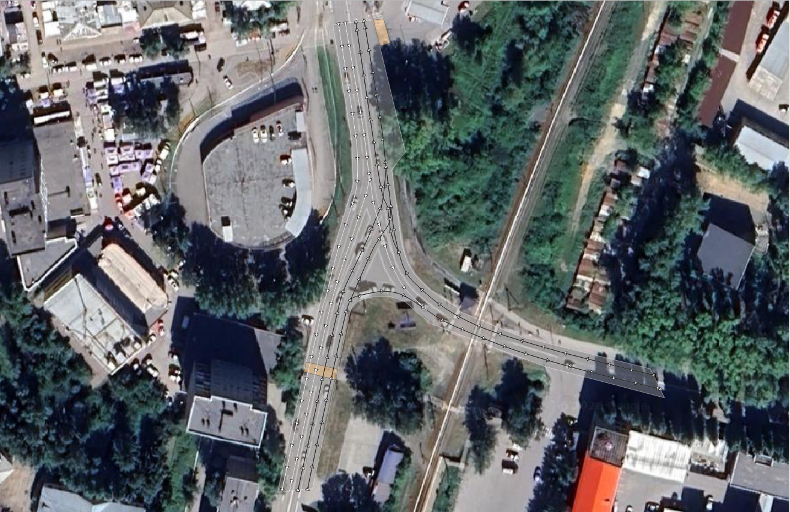

# HD-Mapping & Lane-Level Vectorization Project (Ekaterinburg, RU)

[RU] Проект по созданию высокоточной навигационной карты (HD-map) для беспилотного транспорта (AD) на регулируемом перекрестке улиц Титова — Новинская — Селькоровская.
[EN] High-Definition (HD) mapping and lane-level road network vectorization project for Autonomous Driving (AD) systems at the intersection of Titova, Novinskaya, and Selkorovskaya streets.

---

## 🛠 Реализованные задачи / Key Features:

### [RU]
* **Топологическая точность**: Оцифровка границ проезжей части (`road_polygons`) и пешеходных коридоров (`pedestrian_crossings`) стык в стык с использованием ГИС-снаппинга. Полностью изолированы прилегающие территории (АЗС) и дворовые выезды по линии бордюрного камня.
* **Траекторный граф (`lane_centers`)**: Проложены сглаженные центральные линии полос движения. Зоны слияния потоков и пересечения траекторий (X-crossings) размечены раздельными сегментами линий, чтобы избежать самопересечений в графе.
* **Семантическое наполнение**: Атрибутивная модель вдохновлена подходом OpenStreetMap к разметке направления движения (forward/backward).

### [EN]
* **Topological Accuracy**: Digitized road boundaries (`road_polygons`) and pedestrian corridors (`pedestrian_crossings`) edge-to-edge using GIS snapping. Adjoining territories (gas stations) and backyard exits are fully isolated along the curb line.
* **Routing Graph** (`lane_centers`): Plotted smoothed lane centerlines. Merging zones and path intersections (X-crossings) are split into separate line segments to avoid self-intersections in the graph.
* **Semantic Attributes**: Attribute modeling is inspired by the OpenStreetMap approach to direction tagging. Every vector is populated with a direction attribute (`forward` / `backward`).

---

## 🗺 Визуализация графа движения / HD-Map Preview:

---

## 🗄 Структура геоданных / Repository Structure:
* [lane_centers.geojson](./lane_centers.geojson) — Направленный граф полос / Directed lane-level routing graph
* [road_polygons.geojson](./road_polygons.geojson) — Полигоны проезжей части / Road surface polygons
* [pedestrian_crossings.geojson](./pedestrian_crossings.geojson) — Зоны пешеходных переходов / Pedestrian crossing polygons
